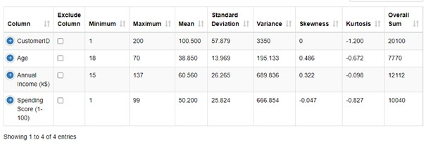
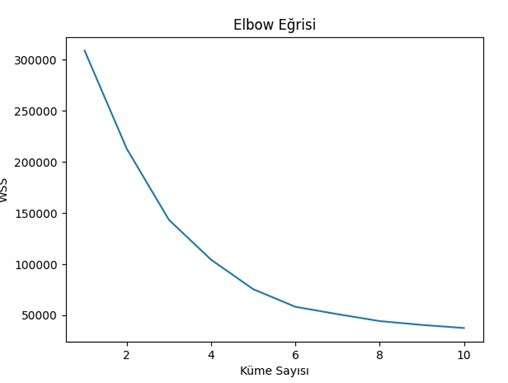
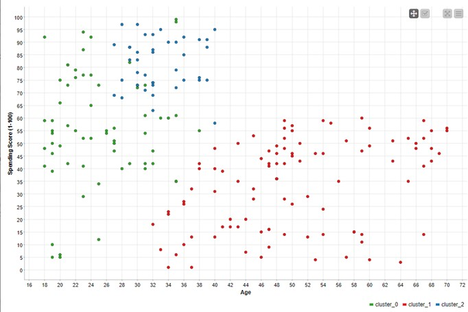

# KNIME ile Alışveriş Merkezi Müşteri Verilerine Ait Kümeleme Analizi

## Hacettepe Üniversitesi Fen Fakültesi İstatistik Bölümü

### İsmail KILIÇ 

--

## K-Means Kümeleme Algoritması ile Müşteri Segmentasyonu 

### Verilere Ait Değerlerin İncelenmesi

Veri seti KNIME(v.5.2.3) programında okutulmuş verilerin değerleri incelenmiştir.

Yapılan analiz sonucunda yaş verileri için minimum 18, maksimum 70 ve ortalama olarak yaklaşık 39 yaş gözlemlenmiştir.
Yıllık gelir için minimum 15$, maksimum 137$ ve ortalama olarak 60.56$ dolar olarak gözlemlenmiştir.
Müşterilerin harcama puanları minimum 1, maksimum 99 olarak gözlemlenmiştir.

### Verilerin Normalleştirilmesi
K-Means kümeleme algoritması için yaş yıllık gelir ve harcama puanları kullanılmış olup normalleştirme için “Min-Max Normalization” uygulanmıştır.

### K-Means Komşuluk Değeri için Elbow Method Uygulaması
K-Means kümeleme algoritmasında komşu “k” değerini belirlemek için “Dirsek Eğrisi (Elbow Method)” yönteminden yararlanılmıştır. 
Dirsek Eğrisi Yöntemi grafiği ile “k” değerinin belirlenmesi için KNIME(v.5.2.3) içerisine “Python Script” kurulmuştur. Python Source düğümü çalışma akışına eklenerek ilgili veri seti için aşağıdaki kodlar uygulanmış ve Dirsek Eğrisi sonuçlarına ulaşılmıştır 

#### Elbow Method Grafiği

Grafik incelendiğinde en uygun “k” değerinin 3 ve 4 olabileceği gözlemlenmiş olup bu çalışmada küme sayısı 3 olarak alınmıştır.

### K-Means Kümeleme Algoritması ve Sonuçları
Yaş, yıllık gelir ve harcama puanlarına K-Means Algoritması uygulanmış olup komşu sayısı 3 olarak alınmıştır.
Normalleştirilen veriler analizin kolaylığını sağlamak amacıyla tekrar normal ölçülerine döndürülmüş komşuların dağılımı için dağılım grafiği (scatter plot) çizdirilmiştir.

#### Model Çıktısı

Müşteri segmentasyonu analizi için bir dağılım grafiği (scatter plot) oluşturulmuş olup yaş ve harcama puanları bakımından aralarındaki ilişki üç farklı kümede gösterilmiştir.
Kırmızı, yeşil ve mavi olarak işaretlenen her renk farklı bir kümeyi göstermektedir.

### Model Sonucu Yorumlama ve Tartışma 
Yeşil ile gösterilen küme 18 – 35 yaş aralığında genç yaş grubunu kapsamakta olup, harcama puanı olarak 5 – 100 aralığında geniş grubu kapsamaktadır. Yüksek düzeyin yoğunlukta olduğu ancak çeşitli düzeylerde harcama puanına sahip genç müşterilerin bu kümede yer aldığını söyleyebiliriz.

Mavi ile gösterilen küme 25 – 40 yaş aralığında orta yaş bireyleri kapsamakta olup, harcama puanı olarak 55 – 100 aralığında dar grubu kapsamaktadır. Yüksek harcama puanına sahip orta yaşlı müşterilerin bu kümede yer aldığını söyleyebiliriz.

Kırmızı ile gösterilen küme 30-70 yaş aralığında geniş bir yaş grubunu kapsamakta olup, harcama puanı olarak 0-40 aralığında yer almaktadır. Yaş bakımından kapsayıcı ancak harcama puanı bakımından düşük aralıkta yer aldığını söyleyebiliriz.

Yapılan kümeleme analizi için genel değerlendirme yapılacak olursa, genç müşterilerin daha yüksek veya düşük harcama puanlarına sahip olabileceklerini, orta yaşlı müşterilerin daha yüksek harcama puanlarına sahip olabileceklerini ancak 40 ve üzeri yaşlardaki müşterilerin daha düşük harcama puanlarına sahip olabileceklerini söyleyebiliriz.

Analiz süreci sonrasında müşterilerin ait oldukları ilgili yaş gruplarına göre satış ve pazarlama stratejileri ile müşteri memnuniyetinin ve kazanımının artacağını söyleyebiliriz.

--

# Kaynakça
https://stackoverflow.com/questions/647515/how-can-i-find-where-python-is-installed-on
https://www.kaggle.com/datasets/nelakurthisudheer/mall-customer-segmentation/data
